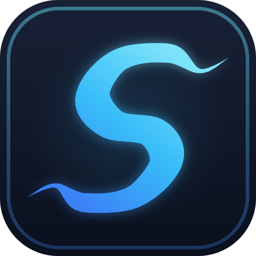
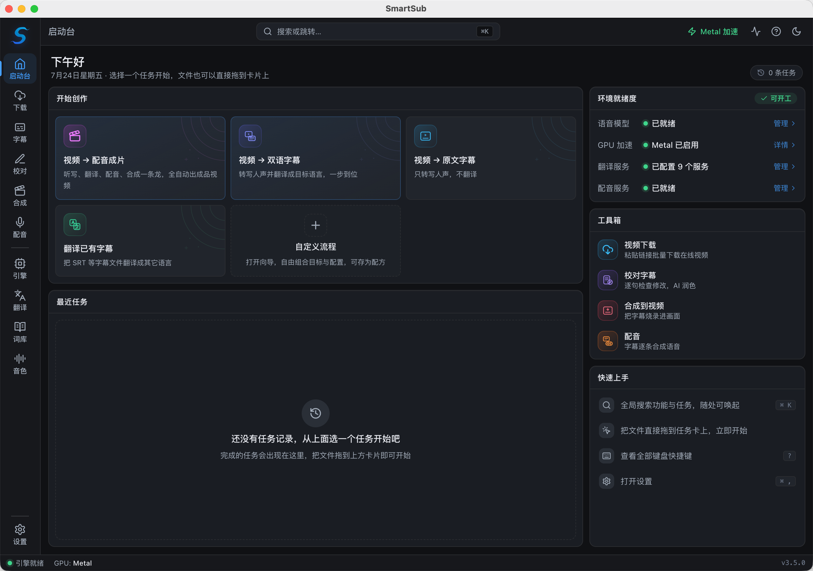
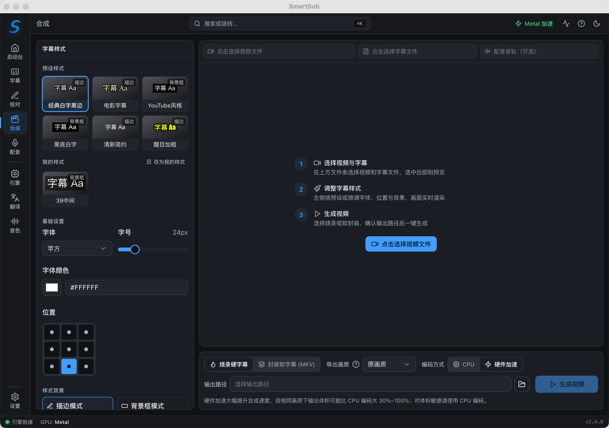
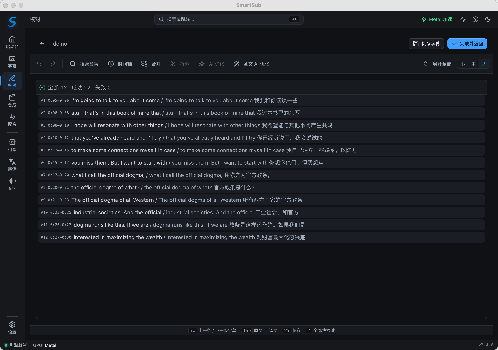

<div align="center">



# 妙幕 / SmartSub

**视频转字幕、字幕翻译、AI 配音与声音克隆、字幕烧录——一站式开源桌面工具**

让每一帧画面都能美妙地表达

<a href="https://trendshift.io/repositories/14079?utm_source=repository-badge&amp;utm_medium=badge&amp;utm_campaign=badge-repository-14079" target="_blank" rel="noopener noreferrer"></a>
<a href="https://trendshift.io/repositories/14079?utm_source=trendshift-badge&amp;utm_medium=badge&amp;utm_campaign=badge-trendshift-14079" target="_blank" rel="noopener noreferrer"></a>

[](https://github.com/buxuku/SmartSub/releases/latest)
[](https://github.com/buxuku/SmartSub/releases)
[](https://github.com/buxuku/SmartSub/releases)
[](https://github.com/buxuku/SmartSub/blob/master/LICENSE)

[中文](README.md) | [English](README_EN.md) | [日本語](README_JA.md)

[下载安装](#下载安装) · [功能特性](#功能特性) · [免费方案](#全流程免费方案) · [常见问题](#常见问题) · [更新日志](https://github.com/buxuku/SmartSub/releases)

</div>



## 妙幕是什么

妙幕（SmartSub）是一款开源的字幕与配音工具，把「语音转文字 → 字幕翻译 → 校对润色 → TTS 配音 → 烧录合成」整条流水线装进一个桌面应用，还内置在线视频下载，粘贴 B 站 / YouTube 等平台链接即可直接取材。转写基于 whisper.cpp、sherpa-onnx 等本地模型完成，文件不出本机；支持批量处理，支持 NVIDIA / AMD / Intel / Apple Silicon 硬件加速，可在 Windows、macOS、Linux 上运行。

**整条流水线可以完全免费跑通**：本地模型转写、内置免费翻译源、本地 TTS 配音（含声音克隆）、本地 ffmpeg 烧录——不需要 API Key，本地环节也没有用量限制。同时可按需接入 20 个翻译服务、8 家云端听写、5 类云端配音服务作为增强。

## 它能帮你做什么

| 你想做的事                       | 妙幕的做法                                                   |
| -------------------------------- | ------------------------------------------------------------ |
| 看无字幕的外语视频、公开课       | 拖入视频，本地转写并翻译，得到双语字幕，播放器直接挂载       |
| 给 B 站 / YouTube 在线视频配字幕 | 粘贴链接应用内直接下载，官方字幕自动配对，无需第三方下载工具 |
| 做视频出海 / 多语言内容          | 字幕翻译成目标语言，再用 TTS 配成外语音轨，导出成品视频      |
| 用自己的声音给视频配音           | 录一段参考音频，零样本克隆音色，整条视频用你的声音朗读       |
| 整理播客、网课、会议录音         | 批量转写成 SRT 字幕文件，供剪辑、检索或存档                  |
| 给成片压制字幕                   | 校对台逐句核对后硬烧或软封装，样式所见即所得                 |

## 功能特性

在线视频**下载** / 本地音视频 → **转写** → **翻译** → **校对** → **配音** → **合成导出**。每一步都可以独立使用，也可以串成流水线批量执行。

### 在线视频下载

- 粘贴链接即可下载 B 站、YouTube 等平台的在线视频，一行一条批量下载，可从混杂文本中自动识别链接
- yt-dlp（YouTube 及 1800+ 站点）与 lux（B 站、抖音、小红书等国内平台）双引擎，按平台自动匹配，应用内一键安装 / 更新
- 可同时下载平台官方字幕（含自动生成字幕），任务向导中自动配对——有官方字幕就无需再转写
- 支持导入站点 Cookie（浏览器一键提取 / cookies.txt / 手动粘贴），解锁登录后可见的高清画质与会员内容，Cookie 仅保存在本地
- 保存目录、清晰度（最佳 / 指定档位）、并发数可调，下载完成一键衔接转写 / 翻译任务

### 字幕生成（转写）

- 多种视频 / 音频格式批量生成字幕，并发任务数可调
- 7 类转写引擎逐任务切换：内置 `whisper.cpp`、`faster-whisper`、`FunASR`、`Qwen3-ASR`、`FireRedASR`、本地 `Whisper CLI`，以及免 GPU 的云端听写（8 家服务商）
- 本地引擎完全离线，无需联网上传；中文场景可直接选用 FunASR / FireRedASR
- AI 字幕精修（可选）：大模型语义断句 + 批量校正——断句按语义重组且时间轴仍精确到词（连接词不吊行尾、数字不被停顿劈开），校正修同音字、去语气词、规范标点；服务商默认跟随 AI 翻译配置（本地 Ollama 零成本），失败自动回退规则断句
- 简繁转换、自定义字幕文件名（方便不同播放器挂载识别）、可选中文字幕去标点

### 字幕翻译

- 20 个翻译服务：内置免费翻译（必应 / 谷歌免费接口，自动回退与限速）、百度、阿里云、腾讯、讯飞、火山引擎、豆包、小牛、DeepLX、Azure、Google，以及 Ollama（本地模型）、DeepSeek、Gemini、通义千问、SiliconFlow、Azure OpenAI、[DeerAPI](https://api.deerapi.com/register?aff=QvHM) 等大模型服务
- 兼容任意 OpenAI 风格 API，可接入自有服务
- 输出纯译文，或「原文 + 译文」双语字幕
- 每个 AI 服务可在界面直接配置自定义请求参数，支持导出导入，无需改代码

### 字幕校对

- 内置校对台，逐句对照视频检查修改，定位精准
- 撤销 / 重做，单条删除可恢复
- AI 一键润色

### TTS 配音与声音克隆

- 独立配音工作台：一份字幕 + 可选视频，逐条语音合成并自动对齐时间轴
- 本地引擎离线免费：Kokoro 多语 103 音色、VITS 中文 174 音色
- 声音克隆：本地 ZipVoice 零样本克隆（一段参考音频即建即用），也支持火山引擎声音复刻 2.0、ElevenLabs 即时克隆
- 云端服务：Edge TTS 免费档、OpenAI 兼容端点（OpenAI / 硅基流动等）、Azure Speech、火山引擎豆包、ElevenLabs
- 时间轴对齐：语速预控制、实测复核、静音间隙借用；超限行列入人工处理清单（改文案 / 单行重生成 / 接受变速）
- 逐行试听、换音色、重新合成；背景音可静音原轨或压低原轨（ducking）
- 输出纯音频（wav / mp3）、替换音轨、混音视频或 MKV 双音轨，可同时导出对齐后的字幕

### 视频合成（字幕烧录）

- 硬字幕：把字幕永久烧进画面，任何播放器都能显示
- 软字幕：以流复制方式无损封装可切换字幕轨
- 字体、字号、颜色、描边、阴影、九宫格位置与多种预设样式
- 所见即所得实时预览

### 隐私与硬件加速

- 本地处理，文件不出本机；云端服务均为可选，首次使用有隐私确认
- GPU 加速：NVIDIA CUDA、AMD / Intel Vulkan、Apple Core ML / Metal
- 应用内下载加速包，无需手动安装 CUDA Toolkit；加载失败自动回退 CPU

## 界面一览

| 视频合成（字幕烧录）                    | 字幕校对                                       |
| --------------------------------------- | ---------------------------------------------- |
|  |  |

## 全流程免费方案

对价格敏感的用户，下面这条路线不花一分钱，也不需要注册任何服务：

| 环节     | 免费方案                                                                | 说明                         |
| -------- | ----------------------------------------------------------------------- | ---------------------------- |
| 视频下载 | yt-dlp / lux 开源引擎                                                   | 应用内一键安装，免费使用     |
| 语音转写 | whisper.cpp / faster-whisper / FunASR / Qwen3-ASR / FireRedASR 本地模型 | 模型下载一次，离线可用       |
| 字幕翻译 | 内置免费翻译（必应 / 谷歌接口，自动回退）、Ollama 本地大模型、DeepLX    | 免费翻译开箱即用，零配置     |
| TTS 配音 | 本地 Kokoro / VITS / ZipVoice 声音克隆；Edge TTS 免费档                 | 本地模型离线合成，无用量限制 |
| 字幕烧录 | 内置 ffmpeg                                                             | 本地合成                     |

付费云服务（OpenAI、ElevenLabs、火山引擎、腾讯云等）全部是可选增强，按需选用。

## 下载安装

根据电脑系统和芯片选择安装包。GPU 加速包无须在下载时选择，安装后在应用内按需下载。

| 系统    | 芯片  | 安装包      | 说明                                              |
| ------- | ----- | ----------- | ------------------------------------------------- |
| Windows | x64   | windows-x64 | NVIDIA 用 CUDA，AMD / Intel 用 Vulkan，应用内下载 |
| macOS   | Apple | mac-arm64   | 自动启用 Core ML / Metal 加速                     |
| macOS   | Intel | mac-x64     | 仅 CPU，不支持 GPU 加速                           |
| Linux   | x64   | linux-x64   | NVIDIA 用 CUDA，AMD / Intel 用 Vulkan，应用内下载 |

下载入口：[GitHub Releases](https://github.com/buxuku/SmartSub/releases) ｜ [夸克网盘](https://pan.quark.cn/s/0b16479b40ca)

macOS 用户推荐使用 Homebrew 安装，会自动匹配芯片类型：

```bash
brew tap buxuku/tap          # 只需执行一次
brew install --cask smartsub # 安装
brew upgrade --cask smartsub # 升级
```

### 三步上手

1. 安装后跟随新手引导下载一个语音模型（无 GPU 或不想下模型，也可配置云端听写）
2. 在启动台选择任务，拖入音视频或字幕文件（或粘贴链接下载在线视频），设置源语言、目标语言等参数
3. 开始处理；完成后可继续校对字幕、配音或烧录合成

## 进阶指南

<details>
<summary><b>转写引擎对比与选择</b></summary>

<br/>

转写引擎可逐任务切换，运行时与模型在「引擎与模型」页面统一管理：

| 引擎                     | 说明                                                               | 运行方式                           |
| ------------------------ | ------------------------------------------------------------------ | ---------------------------------- |
| **whisper.cpp（内置）**  | 默认引擎，支持 ggml 量化模型与 GPU 加速                            | 随应用内置，开箱即用               |
| **faster-whisper**       | 基于 CTranslate2，速度更快，模型按需从 HuggingFace 下载            | 自包含 Python 运行时（应用内下载） |
| **FunASR**               | SenseVoice（中 / 英 / 日 / 韩 / 粤）与 Paraformer-zh，中文表现优秀 | 内置 sherpa-onnx 原生库            |
| **Qwen3-ASR**            | 通义千问语音识别（qwen3-asr-0.6b）                                 | 内置 sherpa-onnx 原生库            |
| **FireRedASR**           | FireRedASR-AED large（中英），中文表现优秀                         | 内置 sherpa-onnx 原生库            |
| **本地 Whisper CLI**     | 调用你自行安装的 whisper 兼容命令                                  | 使用系统已装命令                   |
| **云端听写（在线 ASR）** | 8 家在线服务商，免 GPU、支持多服务商多实例                         | 在线服务（音频上传到你配置的端点） |

FunASR / Qwen3-ASR / FireRedASR 均通过内置的 sherpa-onnx 原生库运行，无需额外环境；faster-whisper 会在应用内下载一个自包含运行时。

</details>

<details>
<summary><b>云端听写：8 家服务商配置说明</b></summary>

<br/>

云端听写在「引擎与模型」左栏的「云端听写」分组中配置。每个服务商是一个独立入口，选中即见配置表单，填入凭据即可（支持「测试连接」）。转写时音频会上传到你配置的端点，首次运行有隐私确认——请勿用于敏感内容，并留意服务商的用量费用。

- **OpenAI 兼容**：`audio/transcriptions` 协议（`whisper-1`、`gpt-4o-transcribe` 等）。OpenAI / Groq / 硅基流动预设直接列在侧栏，其它兼容端点（自建服务、中转站）经「添加自定义」接入，可添加多个
- **ElevenLabs Scribe**：`scribe_v1` 模型
- **Deepgram**：`nova-2` / `nova-3` 模型
- **火山引擎豆包**：录音文件识别·极速版（bigmodel）。使用新版「豆包语音」控制台「API Key 管理」签发的 API Key（需先开通对应模型；火山方舟的 API Key 不通用），按转写时长计费
- **腾讯云**：录音文件识别极速版。使用「语音识别」控制台的 AppID / SecretId / SecretKey（需先开通，每月赠 5 小时免费额度）。识别语言自动跟随任务的「原语言」，模型只选档位——standard 普通版或 large 大模型版（识别更强、计费更高、免费并发仅 5）
- **阿里云**：录音文件识别极速版。使用 RAM 访问控制的 AccessKey ID / Secret，外加智能语音交互控制台项目的 Appkey。识别语种在项目「功能配置」中设定（任务原语言对阿里云不生效），默认普通话模型可识别中英混合。注意该服务**仅提供商用版（无免费试用）**，开通后按转写时长计费
- **讯飞**：录音文件转写大模型。异步订单制，退出应用不丢任务
- **Gladia**：solaria 模型，支持 100+ 语种，每月赠 10 小时免费额度

</details>

<details>
<summary><b>whisper 模型怎么选</b></summary>

<br/>

whisper.cpp / faster-whisper 使用 whisper 系列模型，模型越大越准、越慢、越吃显存：

- 低端设备或核显：推荐 `tiny` / `base`，速度快、占用小
- 普通电脑：从 `small` / `base` 起步，平衡精度与资源
- 高性能显卡 / 工作站：推荐 `large` 系列，精度最高
- 纯英文音视频：选带 `en` 的模型，专为英语优化
- 在意体积：可用 `q5` / `q8` 量化版本，牺牲少量精度换取更小体积

</details>

<details>
<summary><b>GPU 加速</b></summary>

<br/>

软件内置 GPU 加速包管理，无须手动安装 CUDA Toolkit。安装后在「引擎与模型」页面管理 GPU 加速，软件会自动检测显卡并推荐合适的加速方案。

| 平台                          | 加速后端            | 说明                                                              |
| ----------------------------- | ------------------- | ----------------------------------------------------------------- |
| Windows / Linux + NVIDIA      | **CUDA**            | 支持 CUDA 11.8.0 / 12.2.0 / 12.4.0 / 13.0.2，应用内下载对应加速包 |
| Windows / Linux + AMD / Intel | **Vulkan**          | 应用已内置 Vulkan 加速包                                          |
| macOS（Apple 芯片）           | **Core ML / Metal** | 下载 mac arm64 版本后自动启用                                     |
| 任意平台                      | **CPU**             | 无可用 GPU 时自动回退                                             |

- 加速模式支持「自动 / 仅 GPU / 仅 CPU」，加载失败会自动降级到 CPU，并在诊断面板给出原因
- 如启用加速后出现闪退，可切换为「仅 CPU」模式，或改用其它转写引擎

</details>

<details>
<summary><b>翻译服务与自定义参数</b></summary>

<br/>

使用云端翻译服务需要相应的 API 密钥或配置。百度翻译、火山引擎等服务的 API 申请方法可参考 [Bob 的服务申请文档](https://bobtranslate.com/service/)，感谢 [Bob](https://bobtranslate.com/) 这款优秀的软件。

AI 翻译的结果受模型和提示词影响较大，可以尝试不同的模型和提示词组合，找到适合自己的搭配。

每个 AI 翻译服务都支持自定义参数配置，精确控制模型行为：

- 直接在界面添加和管理参数，无需修改代码
- 支持 String、Float、Boolean、Array、Object、Integer 类型
- 参数修改实时校验，防止无效配置
- 支持导出导入，方便共享和备份

</details>

<details>
<summary><b>配音引擎与输出模式</b></summary>

<br/>

本地引擎基于 sherpa-onnx 运行，完全离线免费：

| 模型               | 语言    | 音色     | 说明                                        |
| ------------------ | ------- | -------- | ------------------------------------------- |
| Kokoro 多语 v1.1   | 中 / 英 | 103      | 多语模型，英文与中文音色均衡                |
| VITS 中文 AIShell3 | 中      | 174      | 中文说话人库                                |
| ZipVoice 声音克隆  | 中 / 英 | 用户自建 | 零样本克隆：一段参考音频 + 对应文本即建即用 |

云端服务商按需接入：

| 服务         | 说明                                                                   |
| ------------ | ---------------------------------------------------------------------- |
| Edge TTS     | 免费、无需 Key；属逆向接口试用档，不承诺可用性，断供时建议切换其它引擎 |
| OpenAI 兼容  | `audio/speech` 协议，内置 OpenAI / 硅基流动预设，可添加多个自定义端点  |
| Azure Speech | 微软 Neural 音色体系（700+ 音色），SSML 语速控制                       |
| 火山引擎豆包 | 豆包语音合成大模型音色，支持声音复刻 2.0 克隆音色                      |
| ElevenLabs   | 多语模型，支持即时声音克隆（IVC）                                      |

时间轴对齐机制：合成前按目标时长预控语速，合成后实测时长复核（本地引擎免费重合成，云端用 atempo 变速），不足时向相邻静音间隙借用时间；仍超过 1.5 倍语速红线的行进入人工处理清单，可改文案、单行重生成或接受变速。

创建克隆音色时会自动质检参考音频（时长、信噪比、削波、音量等），给出问题定位与修复建议。

</details>

<details>
<summary><b>手动下载与导入模型</b></summary>

<br/>

模型文件较大，如果应用内下载困难，可以手动下载后导入。whisper 模型下载源：

1. 国内镜像（速度较快）：https://hf-mirror.com/ggerganov/whisper.cpp/tree/main
2. Hugging Face 官方：https://huggingface.co/ggerganov/whisper.cpp/tree/main

苹果芯片需同时下载模型对应的 `encoder.mlmodelc` 文件，解压后放在模型相同目录下（`q5` / `q8` 系列模型无须此文件）。

导入步骤：在「引擎与模型」页面点击「导入模型」，选择下载好的模型文件确认导入；或直接复制到模型目录。

FunASR / Qwen3-ASR / FireRedASR 等引擎的模型可在「引擎与模型」页面内按需下载（支持 ModelScope / GitHub 等多源）。

</details>

## 常见问题

<details>
<summary><b>macOS 提示「应用程序已损坏，无法打开」</b></summary>

<br/>

在终端中执行以下命令后重新运行应用：

```bash
sudo xattr -dr com.apple.quarantine /Applications/SmartSub.app
```

</details>

<details>
<summary><b>模型下载缓慢或失败</b></summary>

<br/>

可以手动下载模型文件后导入应用，见 [手动下载与导入模型](#进阶指南)。国内用户建议使用 hf-mirror 镜像源。

</details>

<details>
<summary><b>启用 GPU 加速后应用闪退</b></summary>

<br/>

在「引擎与模型」页面把加速模式切换为「仅 CPU」，或改用其它转写引擎；诊断面板会给出失败原因。

</details>

## 参与开发

欢迎提交 Issue 和 Pull Request 改进这个项目。

<details>
<summary><b>本地构建</b></summary>

<br/>

1. 克隆项目并安装依赖（安装钩子会自动下载 whisper addon 与 sherpa-onnx 原生库）：

```bash
git clone https://github.com/buxuku/SmartSub.git
cd SmartSub
yarn install
```

2. 启动开发环境：

```bash
yarn dev
```

如原生依赖自动下载失败（网络受限等），可手动执行 `yarn native:fetch` 重试。

</details>

## 赞助商

本项目由以下赞助商支持：

<a href="https://m.do.co/c/604498b8a664" target="_blank" rel="noopener noreferrer"></a>

## 社区与支持

如果这个项目对你有帮助，欢迎点一个 star，或者请作者喝一杯咖啡（请备注你的 GitHub 账号）。使用中有任何问题，欢迎加入 QQ 交流群（群号：655348339）。

| 支付宝收款码                                   | 微信赞赏码                                   | QQ 交流群                              |
| ---------------------------------------------- | -------------------------------------------- | -------------------------------------- |
|  |  |  |

## 致谢

- [whisper.cpp](https://github.com/ggerganov/whisper.cpp) — 本地转写引擎基础
- [sherpa-onnx](https://github.com/k2-fsa/sherpa-onnx) — FunASR / Qwen3-ASR / FireRedASR 与本地 TTS 的运行时
- [FFmpeg](https://ffmpeg.org/) — 音视频处理与字幕烧录
- [Bob](https://bobtranslate.com/) — 翻译服务申请文档

## 许可证

本项目采用 MIT 许可证，详情见 [LICENSE](LICENSE) 文件。

## Star History

[](https://star-history.com/#buxuku/SmartSub&Date)
